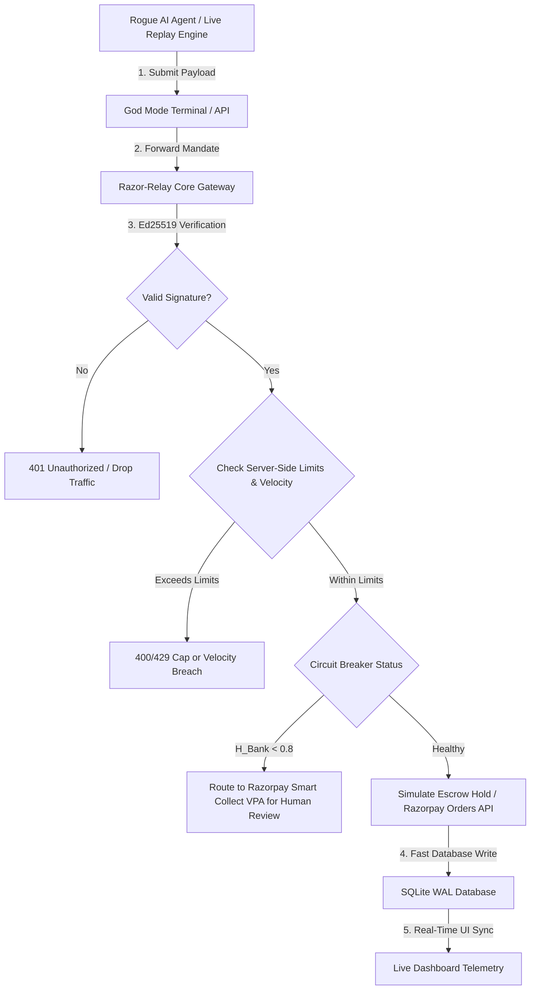

# Razor-Relay: The Sovereign Gateway for Agentic Commerce

I built Razor-Relay because I realized a massive flaw in the future of AI. We are building autonomous agents to buy things, negotiate, and execute tasks, but we are giving them our raw credit cards and API keys. 

Agents hallucinate. They get prompt-injected. They cannot be legally held accountable for draining your bank account.

I wanted to build a system where we do not trust the AI. We trust the math. Razor-Relay is a zero-trust cryptographic gateway that sits between your AI agents and the Razorpay network, ensuring that your agents can only spend exactly what you mathematically allow them to. All financial caps and velocity rules are strictly enforced server-side by the human operator, eliminating the risk of client-side override by hallucinating agents.

---

## 1. The Economics and Business Model

The business model of Razor-Relay is incredibly straightforward and built to scale reliably alongside the growth of agent-to-agent commerce.

1. **The Negotiation:** An AI Agent decides it needs to buy a service (for example, purchasing API credits or cloud storage).
2. **The Cryptographic Mandate:** The Agent creates a "Mandate" (a request to spend money) and signs a strictly canonicalized JSON payload using its deterministic Ed25519 asymmetric private key.
3. **The Interception:** Razor-Relay intercepts this mandate before it hits Razorpay. It verifies the signature against the agent's pre-registered public key, then looks up the agent's hardcoded financial limits on the server (e.g., "This agent cannot spend more than 10,000 INR per transaction", "Cannot exceed 50,000 INR per day", or "Cannot exceed 12 requests per 10 seconds").
4. **The Escrow Simulation:** If the math checks out, Razor-Relay authorizes the transaction. While labeled "Escrow" in the UI for clarity, this simulates a Razorpay Route / Nodal Account hold where funds are ring-fenced for the agent.
5. **The Revenue:** When the service is delivered and funds are settled to the vendor, Razor-Relay takes a **1% platform fee** for securing the transaction. 

As AI agents begin executing micro-transactions at scale, this 1% fee generates a highly scalable, passive revenue stream for the platform.

---

## 2. System Architecture & Flow

To prove this works under pressure, I integrated a Live Replay Engine that streams historical data from the ULB Credit Card Fraud dataset into the gateway. Here is exactly how the data flows from the agent to the dashboard:



---

## 3. Core Technical Engineering (What I Built)

I engineered Razor-Relay to demonstrate handling concurrent, real-world traffic patterns safely.

### High-Throughput Ingestion Engine
I built a background daemon that streams the Kaggle Credit Card fraud dataset directly into the API. This proves the system can ingest, validate, and route high volumes of live transactions without crashing.

### Interactive Threat Mitigation Terminal
I built a "Manual Override" terminal directly into the dashboard. You can act as a rogue AI agent, input a massive financial amount, inject an invalid cryptographic signature, and watch the backend circuit breaker block your attack in real-time on the UI.

### Database Write-Ahead Logging (WAL)
Because the dashboard polls the database 10 times a second for live logs, and the Replay Engine writes to it simultaneously, standard databases would lock and crash. I overhauled the database layer to use SQLite WAL (Write-Ahead Logging) mode, preventing database lockups during concurrent read/write spikes.

### Dynamic Circuit Breaker Failover
If an agent starts hallucinating or upstream APIs degrade, the system continuously calculates a health score (`H_bank = (1 - min(latency, 300) / 300) * (1 - error_rate)`). If the score drops below 0.8 (e.g., >20% error rate), the system stops trusting the automated path. Instead of hard-failing, it instantly routes the quarantined traffic to a Razorpay Virtual Account (Smart Collect) so a human can manually review the transaction.

---

## 4. Setup & Running the Live Demo

If you want to run the full stack (The Gateway, The Replay Engine, and The Dashboard) locally:

### 1. Installation
```bash
git clone https://github.com/MaybeSomeone-arc18/Razor-Relay.git
cd Razor-Relay

# Install Python backend dependencies
pip install -r requirements.txt
cp .env.example .env

# Install Node frontend dependencies
cd frontend
npm install
npm run build:export
cd ..
```

### 2. Booting the Core Infrastructure
Start the FastAPI server. This serves the API gateway and the static frontend UI simultaneously.
```bash
uvicorn main:app --reload --port 8000
```

### 3. Launching the Live Replay Engine
Open a second terminal and start the traffic simulator to feed real data into the gateway.
```bash
python replay_engine.py
```

### 4. Enter the Dashboard
Open your browser and navigate to `http://localhost:8000/ui`. You will immediately see the live telemetry streaming in. Use the Manual Override Terminal to try and hack your own gateway!
