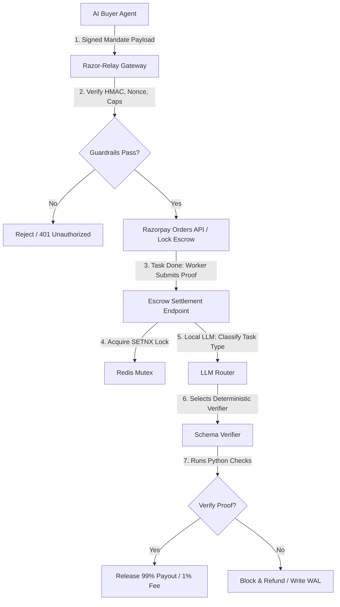

# Razor-Relay

**A zero-trust mandate gateway that allows autonomous AI agents to negotiate and execute payments safely.** 

When autonomous agents buy things for us, we can't hand them raw API keys; Razor-Relay gives them tightly-scoped, 24-hour verifiable mandates that settle funds only when cryptographic proof of work is presented.

---

## 1. Why Now? (The Value Proposition)
Agentic commerce is here, but payment infrastructure is built for humans. An autonomous agent booking a flight or paying for API usage needs a way to commit funds *without* possessing broad withdrawal authority. Combining the principles of UAP (Unified Agent Protocol) and NPCI mandate architectures, Razor-Relay introduces a safe, fail-closed escrow layer between AI agents and Razorpay merchant APIs.

This maps directly to Razorpay's **Agent Studio** and **Agentic Payments** vision: giving agents a secure, restricted, and auditable API channel for transaction execution.

---

## 2. Architecture & Design Principles

Razor-Relay operates on a strict **Zero-Trust AI** principle: **AI is used for routing, never for making money decisions.**



1. **AI Routing:** A local LLM (or Gemini/Groq) reads the task payload and classifies it into a predefined verification schema (e.g., `payment_confirmed`, `data_delivery`).
2. **Deterministic Verification:** The chosen schema maps to a strict Python function. The AI drops out, and the code takes over to verify hashes, Razorpay Order IDs, or webhook timestamps.
3. **Gated Settlement:** If the deterministic verifier returns `True`, funds are routed to the vendor. If `False` or if prompt injection is detected, funds are returned to the buyer.
4. **WAL (Write-Ahead Log):** Every state transition is appended to an append-only log backed by Upstash Redis.

---

## 3. Directory Layout & Critical Source Links

For technical judges auditing the implementation, here are the direct entry points to the core security mechanisms:

*   [`main.py`](file:///Users/sanskarkharya/Razor-Relay/Razor-Relay/main.py):
    *   **Pydantic Money Validation:** (Lines 74–103) Enforces positive numbers (`Field(ge=0)`) on all monetary and limit fields to block negative-value drainage exploits.
    *   **Guardrail Engine:** (Lines 145–196) Implements nonce checks, temporal validation, price slippage validation, and daily cap accumulation.
    *   **Settlement Concurrency Lock:** (Lines 256–260) Atomic `SETNX` lock implementation preventing concurrent payout double-spending.
*   [`agents/verifier.py`](file:///Users/sanskarkharya/Razor-Relay/Razor-Relay/agents/verifier.py):
    *   **LLM Classification Call:** (Lines 212–220) Deterministic classification configuration (temperature = 0.0, seed = 42).
    *   **Deterministic Schema Verifiers:** (Lines 94–177) Python-native verification functions for Orders, Webhooks, and Hashes.
*   [`database/redis_client.py`](file:///Users/sanskarkharya/Razor-Relay/Razor-Relay/database/redis_client.py):
    *   **State Store & Fail-Safe Fallback:** REST-based Redis wrapper featuring a local in-memory fallback for container resilience.

---

## 4. Setup & Running the Live Demo

### 1. Installation
```bash
git clone https://github.com/MaybeSomeone-arc18/Razor-Relay.git
cd Razor-Relay
pip install -r requirements.txt
cp .env.example .env
```

### 2. Run the Live Agent-to-Agent Demo
We provide a script simulating an end-to-end autonomous agent interaction:
1. Start the server in the background:
   ```bash
   uvicorn main:app --reload --port 8000
   ```
2. Run the script:
   ```bash
   python demo/agent_to_agent.py
   ```
This will output a live log showing:
*   **Scenario 1:** The buyer agent issuing a mandate, the gateway locking the escrow, the worker completing work, and Razor-Relay classifying, verifying, and releasing the payout while writing to the Write-Ahead Log.
*   **Scenario 2:** An adversarial prompt-injection attack being safely blocked, keeping the escrow funds protected.

---

## 5. Benchmarks & Results

Tested against a rigorous 100-scenario synthetic batch (including obfuscated prompt injections, boundary webhooks, and logic puzzles):
*   **Accuracy:** **98.0%** (Using local `llama3.2:3b` at temperature=0.0, seed=42).
*   **False Positive Releases (Funds stolen):** **0**
*   **False Negative Blocks:** **2** (Ambiguous tasks safely blocked. We prefer blocked tasks over stolen money).

Run the benchmark yourself:
```bash
pytest benchmark/test_batch_100.py -v
```

---

## 6. Security Posture (What is actually built)
*   **Settlement Concurrency Lock:** A strict `SETNX` lock (`lock:settle:{mandate_id}`) protects the settlement endpoint (`main.py:256`) to prevent race conditions during payout execution.
*   **Nonce Replay Locks:** Mandates include a nonce with a 24-hour TTL, verified on execution to prevent duplicate charges.
*   **Prompt Injection Shield:** A pre-flight regex layer intercepts injection attempts (e.g., "Ignore all previous instructions") and returns a `403` before the LLM even sees the payload.
*   **Server-Side HMAC:** Mandates are signed via HMAC-SHA256, ensuring agents cannot forge authorization.
*   **Fail-Closed Design:** If the LLM goes down, rate-limits, or returns garbage, the system falls back to a restrictive keyword heuristic or blocks the transaction entirely.

---

## 7. Roadmap (What I'd build next)
To take this to production, the following two components need to be implemented:
1. **Async Reconciliation Worker:** A background cron job to sweep and refund `PENDING` escrows that have exceeded their 24h SLA.
2. **Regex-First LLM Bypass:** Instead of regex as just a defense, using it to completely bypass the LLM for common tasks, introducing a caching layer for high-scale throughput.
